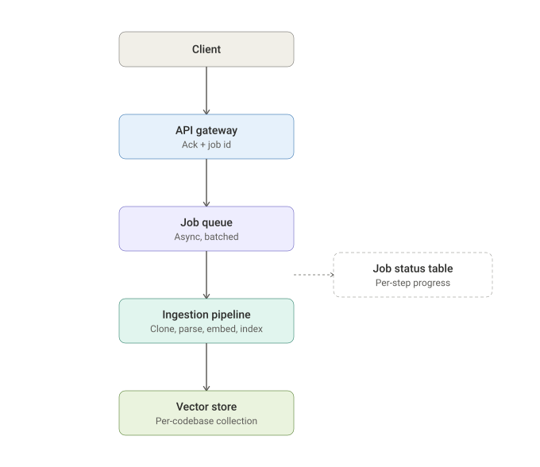
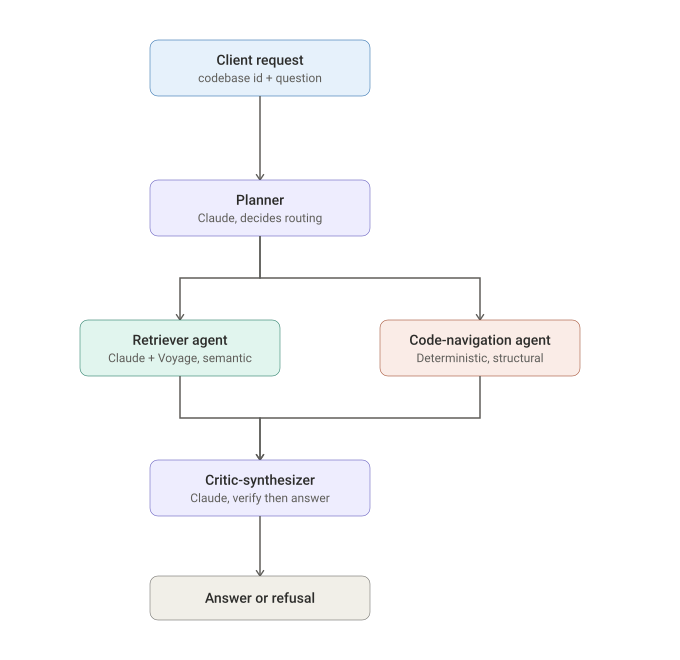
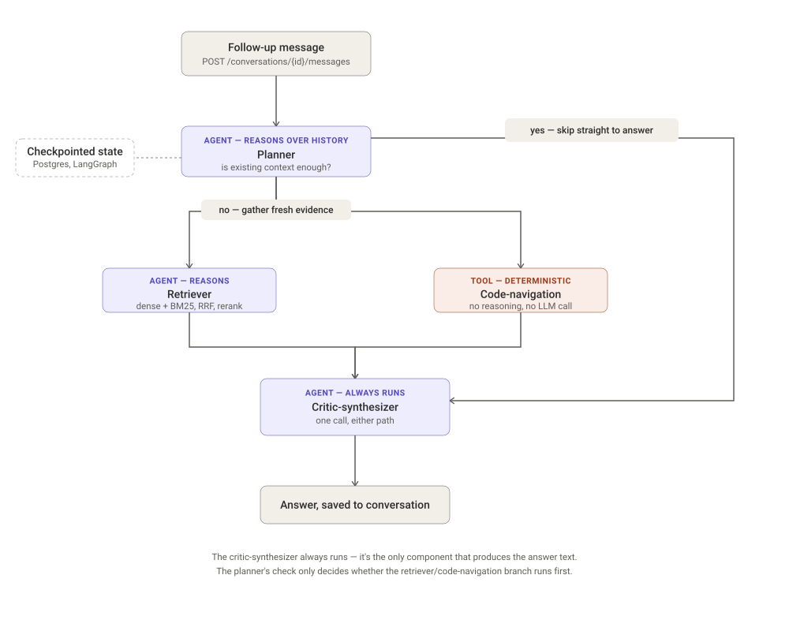

# Architecture

This document describes the system design for `agentic-rag-platform`, including the reasoning behind key decisions and the alternatives that were considered and deferred.

## What the system does

A hosted, multi-agent service that helps engineers understand a codebase. A user submits a public GitHub URL for ingestion; once indexed, they can ask natural-language questions and get grounded, multi-hop, cited answers — routed through a Claude-based planner to a semantic retriever, a deterministic code-navigation tool, or both, then verified and synthesized into a final response.

## Ingestion flow



A client submits a codebase URL. The API acknowledges immediately with a job ID rather than blocking, because cloning, parsing, and embedding a real repository can take longer than a single HTTP request should stay open. A job queue processes the work in batches — not per-file, not as one giant stage — moving through clone, parse, embed, and index. Status is tracked per step in a job status table, which the client polls to check progress. A job is only marked `ready` once every step has fully succeeded; there is no partial or "ready with gaps" state. Once ready, the codebase's vectors live in their own isolated collection in the vector store, and its symbols/references live in the code-navigation index.

## Query flow



A client sends a question along with an explicit codebase ID (never inferred from the question text). A Claude-based planner reads the question and decides which agents are needed: a semantic retriever (embeds the query with Voyage, searches the codebase's vector collection), a deterministic code-navigation tool (symbol lookup, call-graph traversal, no LLM dependency, no reasoning), or both — branching rather than looping, with no path permanently closed off. Each agent owns its own bounded retry logic internally before reporting a final result. Once collection is complete, a single critic-synthesizer call reviews the gathered evidence, verifies it's sufficient, and either produces a cited answer or refuses — collection is never re-triggered after this point. The whole request is a single blocking HTTP call; given the bounded, few-second latency of two Claude calls plus fast lookups, there is no async job pattern or streaming on the query path.

This single-shot flow is for one-off questions. For follow-up/conversational questions, see decision #29 — a separate, LangGraph-backed conversation flow persists state across requests via a Postgres checkpointer, letting the planner reason over prior turns rather than starting from zero each time.



The conversation flow adds exactly one new decision point ahead of the familiar branch: the planner first checks whether existing conversation context already answers the follow-up, and only invokes the retriever/code-navigation branch if it doesn't. The critic-synthesizer always runs regardless of that decision — it's the only component that produces the final answer text (decision #11 combined verification and generation into one call), so skipping it was never actually available as a cost-saving option. The real savings from this decision point is in skipping the *upstream* embedding/search/reranking calls when they're not needed, not in skipping verification.

## Shared parsing layer

Both retrieval (chunking) and code-navigation (symbol/reference indexing) depend on the same structural parsing capability, built once rather than twice:

- **Parser**: tree-sitter, Python only for v1. Structural queries (not proximity heuristics) are used to attach docstrings and preceding comments to the function/class node they belong to, since docstrings are structurally nested as the first statement in a body, and standalone comments are matched via immediately-preceding-sibling relationships in the tree.
- **Retrieval chunk granularity**: function-level (the default, most granular unit — each chunk includes its attached docstring/comment) and module-level (captures file-level docstrings, top-level framing comments, and anything that doesn't belong to a single function). Class-level chunks were considered and deliberately omitted — a class's own docstring is captured at module level, and its methods are already covered as function-level chunks, so a third granularity added marginal coverage for real added complexity.
- **Code-navigation index entities**: functions/methods, classes, module-level named constants, and imports — anything that could plausibly be the *subject* of a cross-file structural question ("find callers of X," "find subclasses of X," "which files import X"). Local variables and literals are excluded, since nothing outside their own scope can reference or query them.

## Design decisions

Each decision below states what was chosen, and — where relevant — what was considered and deferred instead, and why.

1. **Hosted service, not a local tool.** Chosen deliberately over a CLI/localhost tool because it forces real architectural problems — async ingestion, durable job state, multi-tenant isolation — that make the scaling and clean-code goals of this project credible rather than theoretical.

2. **v1 scope: public GitHub URLs only, no private-repo authentication.** An explicit, stated limitation rather than an oversight — avoids taking on credential handling and secrets management before the core pipeline is proven.

3. **Ingestion is asynchronous.** The client receives an ack and a job ID immediately; the actual clone/parse/embed/index work happens out of band, because it can't reliably fit inside a single request/response cycle.

4. **Job status is discovered via polling, not push (webhook/SSE/websocket).** The client's runtime is unknown and unconstrained — a CLI, a script, anything — and push mechanisms assume things about the client (a reachable endpoint, a held-open connection) that don't hold universally. Polling also avoids fighting the stateless-server scaling goal.

5. **Job status is tracked per step, not as a single binary flag.** Gives the client visibility into pipeline progress (clone → parse → embed → index) rather than an opaque wait.

6. **Job readiness is all-or-nothing.** A job is either fully `ready` or `failed` — never partially queryable. Incomplete grounding is treated as worse than no answer at all; this is central to the system's trust story and later resolves a class of cross-file-reference concerns for free (a query can never hit a state where one referenced file is indexed and another isn't).

7. **Ingestion is processed in batches, not per-file streamed.** Per-file streaming was considered for maximum retry granularity and pipeline throughput, but dropped due to the complexity of concurrent rate-limit handling against the embedding API. Batching keeps most of the benefit — partial-progress retry, no full-pipeline restart on failure — with bounded, controllable concurrency.

8. **Codebase identification is always an explicit ID, never inferred from question text.** Deterministic and unambiguous. Implies a `GET /codebases` listing endpoint is needed so clients can discover valid IDs.

9. **Query routing is agent-driven (the Claude-based planner decides), not rule-based/regex classification.** Avoids building and maintaining a brittle keyword/pattern classification layer to cover open-ended user intent.

10. **The code-navigation tool is deterministic and has no hard Claude/Voyage dependency in its implementation** — but in the running system it is only reachable via the Claude-based planner, since routing itself requires a planner call. It is decoupled by design and testable in isolation, not reachable standalone in deployment.

11. **Critic and synthesizer are combined into a single Claude call**, not split into separate agents. Splitting was considered for independent judgment — avoiding the bias of a generation-focused prompt toward completing the task — but the cost of a guaranteed extra call per query outweighed the benefit, given disciplined prompting (explicit refuse-over-fill instructions, mandatory per-claim citation) can achieve similar grounding at lower cost. Accepted as a known, documented tradeoff rather than a fully solved problem.

12. **Retry logic lives inside the retriever agent and code-navigation tool, in the collection phase — not at the critic.** The critic never triggers additional data collection; it only evaluates a closed, final set of evidence. This keeps its role a simple gate (answer or refuse) rather than an orchestrator.

13. **Query answering is a single blocking HTTP request — no async job pattern, no token/progress streaming.** Unlike ingestion, a query's critical path (two bounded Claude calls plus fast index/graph lookups) has a predictable, few-second latency well within HTTP timeout limits. Progress streaming (à la Claude Code) was considered but rejected: that pattern solves open-ended, unpredictable-duration waits, which this system doesn't have. Deferred as a future item if p95 latency ever grows materially.

14. **Vector storage: a separate collection per codebase, not a shared index with metadata filtering.** Metadata filtering is a legitimate, widely used multi-tenant pattern and would likely be preferable at large tenant scale (thousands+), where per-tenant physical isolation becomes an operational burden. At this project's scale, separate collections were chosen because clean reingest/delete of a single codebase is a first-class requirement, and structural isolation removes reliance on every future code path correctly applying a filter. This is a scale-bounded decision, not a universal best practice, and would need revisiting if tenant count grew significantly.

15. **The raw cloned repository is discarded after ingestion**, not retained in object storage. Ephemeral local disk is used as scratch space during cloning/parsing only; nothing downstream (retrieval, code-navigation) queries the filesystem directly, and since v1 sources are always public GitHub URLs, the origin is always re-fetchable on demand. Deferred — would become necessary if private or non-GitHub sources are added later, where the origin isn't guaranteed re-fetchable.

16. **Evaluation uses a golden dataset built on a known repository (the project's own)**, with hand-defined question/expected-evidence pairs, graded by an LLM-as-judge rather than exact-match scoring, since answers are prose.

17. **A semantic query/answer cache was considered and deferred to a future version.** The cost argument favors it (embedding a query via Voyage is near-free; the expensive part is the Claude reasoning pipeline, which a cache hit would skip entirely) — but it was deferred because a false-positive cache hit means silently serving a wrong answer for a different question, directly undermining the system's grounding and trust goals, and because there isn't yet real usage data to responsibly tune a similarity threshold against.

18. **Observability captures per-query, per-step data across the full pipeline**: planner reasoning and routing decisions, retriever results and similarity scores, code-navigation results (including not-found cases), critic-synthesizer sufficiency judgment and final output, and per-step/total timing. This serves two distinct purposes — debugging low eval scores, and substantiating the project's scaling and latency claims with real measured numbers rather than assumptions.

19. **Embedding model: `voyage-code-3` for both indexing and querying.** Chosen over a general-purpose text embedding model because it's trained specifically on natural-language-to-code retrieval (including docstring-to-code), matching the project's core requirement that intent captured in comments/docstrings be retrievable via natural-language questions.

20. **Retrieval combines dense (Voyage `voyage-code-3`) and sparse (BM25) search, merged via Reciprocal Rank Fusion, then reranked with Voyage's reranker before reaching the critic-synthesizer.** Dense search alone under-serves exact literal matches (identifiers, error strings, symbol names) since it's optimized for semantic similarity, not term matching — the same underlying gap that motivated the separate code-navigation tool, but addressed here within the retriever itself. RRF was chosen over hand-tuned score weighting because BM25 and cosine similarity scores aren't on comparable scales, and RRF (rank-based, not score-based) is the standard, low-maintenance way to combine them. Reranking runs as a final pass over the fused candidate set — first-pass retrieval optimizes for fast recall across a large index; reranking affords a slower, more accurate relevance judgment only once the field is already narrowed.

21. **Code-navigation index: relational schema (symbols + references tables), built once during ingestion, stored alongside job/status data — not a dedicated graph database.** Call-graph queries at this project's scale are shallow, bounded lookups (mostly one-hop "who calls X"), well within what relational joins/recursive queries handle without added infrastructure. Neo4j was considered — genuinely tempting as a skills-display choice — but rejected for this project specifically because the system's actual query patterns don't require graph-database capability, and choosing infra to showcase a skill rather than to solve a real constraint would undercut the project's broader story of deliberate, defensible tradeoffs. Noted as a better fit for a separate, smaller project where the domain genuinely needs graph traversal.

22. **Index entities are scoped to codebase-wide referenceable symbols only: functions/methods, classes, module-level named constants, and imports.** Local variables and literals are excluded — the test applied: can something elsewhere in the codebase meaningfully reference or query this as a distinct thing? Local variables fail that test by definition (scope-confined), the same way class-level questions ("find subclasses of X") showed classes must pass it.

23. **Datastores: Postgres for relational data (job status, symbols/references index), Qdrant for vector storage.** Postgres is the uncontested choice for job status and the code-navigation schema — mature, well-understood, handles the rare multi-hop call-graph case via recursive queries without added infrastructure. Qdrant was chosen over Pinecone, Weaviate, and pgvector specifically because it supports named collections per codebase (a direct fit for decision #14's isolation requirement), has native BM25 support as a sparse vector type (avoiding a separate Elasticsearch cluster for the lexical half of hybrid search), and exposes Reciprocal Rank Fusion as a first-class query parameter — turning decision #20 into configuration rather than custom fusion logic. pgvector was considered to keep a single database, but rejected because its hybrid-search story is far less mature than a purpose-built vector database's, and hybrid search was already a deliberate requirement.

24. **Inner functions are not indexed as separate symbols — including closures returned by their enclosing function.** They fail the same referenceability test as local variables: nothing outside the enclosing function can call an inner function directly. A returned closure is technically callable elsewhere, but it's still conceptually owned by the function that defines and returns it, and is represented as part of that parent function's chunk rather than as its own indexed entity.

25. **Bare-name symbol resolution ambiguity (e.g. two unrelated classes each defining a `validate` method) is surfaced, not silently collapsed or resolved by asking the user.** Code-navigation returns all matches for a given first-pass, bare-name lookup, tagged with their defining class/module, rather than merging them into one undifferentiated result. The critic-synthesizer — which also has the retriever's semantic evidence and the original question's wording — is left to disambiguate using that fuller context, or to refuse per decision #11 if it genuinely can't. A clarification round-trip back to the user was considered and rejected, since query-answering is a single blocking request/response (decision #13) with no multi-turn loop to ask a follow-up in.

26. **API contract: four endpoints, each mapped to a single concern.** `POST /jobs` (body: `{url}`) starts ingestion and returns an ack + job ID; `GET /jobs/{id}` returns per-step status (status, optional current batch, optional failure reason); `GET /codebases` lists ingested codebases; `POST /codebases/{id}/query` (body: `{question}`) runs the full agentic pipeline. Job creation and job status were kept as separate endpoints (mirroring decisions #3–#5), and querying was given its own sub-resource path rather than overloading `POST /codebases/{id}`, since "info about a codebase" and "ask it something" are different concerns. The query response includes: `answer` (null on refusal), `refused` (boolean + reason), `citations` (a list of `{source: "retriever" | "code_navigation", file_path, line_range}` — both agents' citations carry file+line precision, since collapsing code-navigation's exact lookups down to a bare file path would discard the precision that's specifically its value-add over the retriever), and `sources_used` (which agents were actually invoked). Exposing `sources_used` to the client was considered a possible way to let users steer future routing, but rejected as a real concern: routing is decided before the response is generated, so the field is read-only and after-the-fact, and the planner already reads free-text routing hints the same way regardless of whether this field exists.

27. **Observability stack: Prometheus + Grafana for metrics, OpenTelemetry + Tempo for traces, Grafana as the unified front end for both.** Decision #18 defined two different kinds of data to capture — time-series/numeric (per-step and total latency, throughput) and structured per-request reasoning data (planner decomposition, retriever/code-navigation results, critic-synthesizer judgment). These aren't the same kind of data and don't fit one tool well: metrics are the natural fit for Prometheus/Grafana dashboards, substantiating the project's scaling and latency claims with real numbers; the reasoning/evidence chain per query is better represented as a trace (planner → retriever/code-navigation → critic-synthesizer as a span tree with attributes), which is what OpenTelemetry and a trace backend like Tempo are built for. Grafana was chosen specifically because it can visualize both sources through one interface rather than requiring two separate front ends.

28. **Orchestration is plain Python (a function that calls the planner, branches on its output, calls the critic-synthesizer), not a framework like LangGraph.** LangGraph's core value is managing complex, stateful, cyclical agent graphs — loops, multi-turn state, dynamic replanning — none of which this system has by design: routing is a single branch (not a loop, decision #9), and collection never re-triggers after the critic sees evidence (decision #12). Adding a graph-orchestration framework to represent a linear branch-and-merge flow would introduce abstraction without solving a real problem, and would obscure the control flow that OpenTelemetry tracing (decision #27) already makes visible directly. Same pattern as the Neo4j and live-Kubernetes-as-runtime decisions: ruled out because the system's actual complexity doesn't justify the tool, not because the tool lacks merit generally.

29. **Multi-turn conversational follow-up, via LangGraph, backed by Postgres for checkpointing.** Decision #13 scoped querying as single-shot and stateless — reasonable at the time, since no conversational feature existed yet. Real usage naturally involves follow-up questions ("why does that retry 3 times?" → "what else calls it?"), which requires state that persists *across* separate HTTP requests, not just within one. This is the genuine justification for LangGraph in this system: its checkpointing/persistence layer and conditional multi-node routing map onto a real requirement (state surviving between requests, and the planner needing to decide per-turn whether fresh retrieval is needed or the existing conversation context suffices) — unlike the original single-shot pipeline, which was a linear branch-and-merge that plain Python expressed more simply (decision #28). New resources: `POST /codebases/{id}/conversations` creates a conversation; `POST /conversations/{id}/messages` sends a follow-up, returning the same response shape as the original query endpoint (answer/refused/citations/sources_used), now scoped to the session. The original single-shot `POST /codebases/{id}/query` endpoint remains for one-off questions that don't need a conversation.

30. **Conversation endpoint schemas.** `POST /codebases/{id}/conversations` takes no body and returns `{conversation_id}` — a conversation starts empty, so nothing else is worth returning yet. `POST /conversations/{id}/messages` takes `{message}` and returns the same shape as the single-shot query response (decision #26: `answer`, `refused`, `reason`, `citations`, `sources_used`), plus `used_existing_context` (boolean) — whether the planner's context-sufficiency check bypassed fresh retrieval/code-navigation for this turn. That field was weighed against the same test applied to `sources_used`: is it read-only, after-the-fact, and does it hand the client a new steering lever over the planner? It doesn't — a user could already learn to influence planner routing through free-text phrasing in the single-shot flow, so a conversation's visible turn-by-turn trajectory doesn't introduce a new control surface, only a more visible one. The response returns only the current turn's answer, not the full conversation history — history is server-side state via the LangGraph checkpointer, and the client never needs to reconstruct or resend it.

31. **Single-shot query and conversation remain two separate entry points, rather than collapsing into one LangGraph-routed endpoint or making every query an implicit one-turn conversation.** Once LangGraph was adopted for conversations (decision #29), collapsing both paths into one orchestration was considered, since the framework dependency was already paid for. Rejected because it would force every caller — including the evaluation harness (decision #16) and any scripted/programmatic usage — through conversation creation and checkpoint writes for state that would never be read again, and because routing every request through the graph "to check if it's needed" reintroduces the exact overhead decision #28 avoided. Keeping two entry points means the LangGraph-vs-plain-Python decision is made once, at the API layer, based on which endpoint was called — not re-derived at runtime.

32. **Retriever iteration is a two-stage mechanism: a free, deterministic confidence gate followed by one bounded, genuinely agentic reformulation call.** After the first-pass hybrid search + rerank (decision #20), a reranker-score threshold — no Claude call — decides whether the results are good enough to hand to the critic-synthesizer as-is. Only when that check fails does the retriever spend a Claude call: it reviews what the first pass actually returned, reformulates the query, and searches again, bounded to a single retry. This resolves a real tension in the retry logic assigned to the retriever by decision #12 — an unconditional Claude-in-the-loop review on every query pays for a judgment call even when the first pass was fine, while a purely infra-level retry (backoff on transient failures) would quietly abandon the query reformulation the README's core differentiator from naive RAG depends on. Splitting the mechanism keeps the common case free and reserves the genuinely agentic step for when it's earning its keep, while the bound (one retry, not a loop) keeps it consistent with decision #9's rejection of open-ended looping at the orchestration level — the loop here is local to the retriever and hard-capped, not propagated upward.

33. **The planner is a single structured-output Claude call, not a tool-use loop.** Plain Python (decision #28) invokes the planner once, receives a structured decision, and branches on it directly — the planner never calls the retriever or code-navigation tool itself mid-reasoning. A tool-use loop would let Claude decide at runtime when to invoke each agent and when to stop, reintroducing the unbounded-loop complexity decision #12 already ruled out for the orchestration layer. The planner's structured output is: `agents_needed` (which of retriever / code-navigation to invoke), a query string for the retriever, and any symbol name(s) extracted for code-navigation.

34. **Code-navigation targets are extracted entirely by the planner; code-navigation itself performs a pure lookup with no reasoning of its own.** The planner's structured output (decision #33) includes the exact symbol name(s) to look up — all natural-language-to-symbol translation happens there. Code-navigation receives an exact name and returns matches (or surfaces ambiguity per decision #25); it never interprets what the user meant. This is the concrete mechanism behind decision #10's claim that code-navigation has no Claude/Voyage dependency in its own implementation.

35. **A unified evidence schema is shared between retriever and code-navigation results before reaching the critic-synthesizer** — one list of items with a common envelope and source-specific fields, rather than two separately-shaped result sets the critic has to handle differently:

    ```
    EvidenceItem {
      source: "retriever" | "code_navigation"
      file_path: string
      line_range: [start, end]
      content: string                # code snippet (retriever) or symbol context (code-navigation)
      score: float | null            # retriever only -- rerank score
      symbol_name: string | null     # code-navigation only
      symbol_kind: string | null     # code-navigation only -- function/class/constant/import
      reference_kind: string | null  # code-navigation only -- definition/call/subclass
    }
    ```

    This shape maps directly onto the citation format from decision #26 (`source`, `file_path`, `line_range`) with no translation step between evidence and citation, and gives the critic-synthesizer one consistent structure to iterate over regardless of which agent produced each item.

36. **Model selection is split: a faster/cheaper model (Haiku) for the planner and retriever-reformulation calls, a stronger model (Sonnet) for the critic-synthesizer.** The planner's routing decision and the retriever's reformulation (decision #32) are both narrow, well-scoped tasks suited to a lighter model. The critic-synthesizer is the highest-stakes call — the final sufficiency judgment and answer generation the system's whole trust story rests on (decision #11) — and is worth the stronger model specifically for that call.

37. **The job queue is Postgres-native — `SELECT ... FOR UPDATE SKIP LOCKED` against the existing `jobs` table — not a separate broker (arq, Celery, Kafka, or otherwise).** Postgres is already the system of record for job status (decision #23), so a worker claiming the next `queued` row under `FOR UPDATE SKIP LOCKED` gets a correct, concurrency-safe dequeue without introducing a new datastore dependency. This is a smaller version of the same reasoning as decision #21 (relational Postgres over standing up Neo4j): don't add infrastructure a well-understood access pattern doesn't require. Kafka specifically was considered and rejected — its value is an ordered, durable, replayable log that many independent consumers read at their own pace, at high sustained throughput; ingestion has one producer and one logical consumer (the pipeline itself), no downstream service needs to replay or independently observe ingestion events, and the project's scope (decision #2, decision #14's repeated "at this project's scale") doesn't involve the tenant volume that would make that matter. The locking clause is included from the start even though a single worker doesn't strictly need it yet, since it's what lets worker count increase later — one process or several, one machine or many — with no design change, which is also why Kafka isn't a prerequisite for scaling workers: worker count and broker technology are independent axes, and Postgres's queue already generalizes to multiple concurrent workers on its own.

38. **Default concurrency is one active ingestion job at a time, with the rest sitting `queued`.** This isn't just a limitation of running locally — it follows from decision #7's own reasoning. The embed stage is bounded by the embedding API's rate limit, an external, fixed constraint; running multiple jobs concurrently doesn't add real throughput, it just makes multiple jobs compete for the same limited quota, produces more 429s and backoff, and makes behavior harder to reason about, for no net gain. `max_concurrent_jobs` is a config value (default 1) rather than a hardcoded constant, so it isn't structurally incapable of increasing later — but raising it only pays off alongside a real per-job rate-limit budgeting strategy, not before one exists.

39. **Per-job execution state is a `pipeline_state JSONB` column, replacing the unused `current_batch TEXT` stub, rather than a normalized `job_batches` table.** The batch list, current position, and attempt counts for a job are written and read exclusively by the one worker executing that job, as a whole unit, every time — no query pattern needs "batch 3 across all jobs." That's the concrete case where JSONB beats a relational table: no cross-row access pattern to serve, and the shape can evolve (adding a reformulation-attempt field, say) without a migration. The coarse, actually-queried columns (`id`, `url`, `status`) stay exactly as they are, since `status` is what both the dequeue query and `list_ready_codebases` filter on. If cross-job batch-level visibility ever becomes a real need (e.g. "are embed retries elevated this week"), that belongs to OpenTelemetry tracing (decision #27), not to normalizing this column into queryable tables — otherwise the two mechanisms would overlap.

40. **LangChain was considered and rejected.** Its value is real but specific: a unified interface across many swappable model/vector-store backends, a large pre-built document-loader ecosystem for heterogeneous data sources, and fast scaffolding for standard chain/agent patterns when requirements are still loose. None of that matches this system. Every LLM-touching component is a single, fully-specified call with a known input/output contract — the planner and critic-synthesizer are each one structured-output Claude call (decisions #33, #11), and the retriever calls Voyage and queries Qdrant directly, with RRF fusion happening inside Qdrant's own query API (decision #23) rather than needing an ensemble-retriever abstraction on top. Ingestion already has a purpose-built tree-sitter parsing layer for structural chunking, which is strictly better for this codebase-specific use case than LangChain's generic document loaders/text splitters. Provider-swapping — the one LangChain use case that could apply here — isn't a stated requirement (the README commits explicitly to Anthropic and Voyage), and even if it becomes one, it doesn't require the framework: three call sites behind a small hand-rolled interface (one method, one schema-in/JSON-out contract) gets the same swappability with full visibility into every request, which decision #18's observability goals depend on — a generic abstraction layer would make that harder to get without adopting more of the LangChain ecosystem (callbacks, LangSmith) to recover it.

41. **`agents_needed` can legitimately come back empty from the planner, for two distinct reasons — and the critic must be explicitly instructed to refuse, not answer from pretraining, when it does.** Two real cases, not one: (a) a single-shot question that's genuinely off-topic for the ingested codebase — the planner recognizes this and skips the retriever/code-navigation calls entirely, saving a Haiku + Voyage round-trip it would otherwise pay for evidence that couldn't be relevant anyway; (b) a conversational follow-up where the existing evidence already gathered in prior turns is sufficient — this is not new; decisions #29 and #30 already anticipated it (`used_existing_context`, "the planner needing to decide per-turn whether fresh retrieval is needed or the existing conversation context suffices"), this decision just makes the empty-`agents_needed` mechanics behind that explicit. In both cases the critic-synthesizer still runs — decision #11 makes it the only component that produces final answer/refusal text, so there's no path that skips it — but it now receives either zero evidence (case a) or reused prior-turn evidence (case b) instead of freshly gathered evidence. Case (a) only works correctly if the critic's prompt explicitly treats an empty evidence list as an automatic refusal; without that instruction, an LLM asked to "answer this question" with nothing to cite could reach for its own pretrained knowledge instead, which is exactly the fabrication failure mode decision #11's refuse-over-fill design exists to prevent — so this is a required prompt-design point, not an incidental one. Case (b) is conversation-specific and has an architectural consequence: unlike the single-shot planner, the conversation-flow planner invocation needs the accumulated prior-turn evidence as an input (pulled from the LangGraph checkpointer, decision #29), not just the current question — it can't make a reuse-vs-refetch call over evidence it never sees. By the same logic as decision #12 (the critic never re-triggers or judges what to collect, only evaluates what it's given), that reuse-vs-refetch decision has to sit with the planner, not the critic.

42. **The planner's structured output (decision #33) is produced via forced tool-use** (Anthropic Messages API, `tool_choice` pinned to a single tool), not prompted free-text JSON — guarantees schema-conforming output without a parse-and-retry loop, which a prompted-JSON approach would need. The tool, `route_query`, takes: `reasoning` (string, brief routing rationale, feeding decision #18's observability requirement); `agents_needed` (array of `"retriever" | "code_navigation"`, can be empty per decision #41); `retriever_query` (string or null, non-null iff `retriever` is requested — must be self-contained, since the retriever never sees conversation history, only this string, so resolving any pronoun/reference back to prior turns is the planner's job, not the retriever's); `code_navigation_symbols` (array of strings, non-empty iff `code_navigation` is requested, per decision #34's exact-name-extraction requirement); and `existing_context_sufficient` (boolean, meaningful only when `agents_needed` is empty — true means prior-turn evidence in this conversation already answers the question, false means no evidence applies at all, whether because it's the first turn or because the question is off-topic despite unrelated prior evidence existing in the conversation). That last field exists because decision #41's two empty-`agents_needed` cases aren't distinguishable from the output shape alone: a conversation can have substantial prior evidence on the record and still receive an off-topic follow-up, so "prior evidence exists" can't be used to infer "prior evidence is relevant to this question" — only the planner, seeing both the live question and the actual prior evidence together, can make that call. Downstream, evidence accumulates turn-over-turn except in the off-topic case, where the critic deliberately receives an empty evidence set for that turn rather than stale, irrelevant context that could make a refusal look wrongly grounded. `used_existing_context` on the API response (decision #30) is derived, not planner-output: `agents_needed == [] and existing_context_sufficient == true`. Conditional consistency between `agents_needed` and the two per-agent fields is enforced with a plain assertion in the orchestrating Python function after the call returns, not JSON-schema `if/then` conditionals — consistent with decision #28's preference for plain code over abstraction where a two-line check does the job and is easier to log and debug on failure than a schema-validation rejection.

43. **Code-navigation's `symbols`/`symbol_references` tables gain a `source_text` column, populated at ingestion time, rather than fetching code text at query time.** Decision #35's `EvidenceItem.content` is meant to hold "code snippet (retriever) or symbol context (code-navigation)" — but the existing schema (decision #21) only ever stored structural metadata (kind, name, qualified_name, file/line/byte ranges, docstring), never the underlying source text, so code-navigation had nothing to put in that field. Re-fetching from the original repo at query time was considered and rejected: decision #15 already discards the clone specifically because nothing downstream was supposed to need filesystem access post-ingestion, and re-cloning per query would blow decision #13's few-second blocking-request latency budget besides. Storing the snippet is effectively free: the parser already computes `start_byte`/`end_byte` while walking each file during ingestion, meaning the file's content is already in memory at that exact point — slicing and storing the substring adds no new computation, only storage. Already-ingested codebases will have `NULL` in this column until re-ingested; not treated as a migration to solve now, since decision #15's "origin is always re-fetchable" reasoning covers it — re-ingesting the same public URL backfills it.

44. **Code-navigation-as-agent calls both `find_definition` and `find_references` for every symbol the planner requests, unconditionally.** The planner's `code_navigation_symbols` (decision #42) is just a list of names — it doesn't say whether "where's this defined" or "who calls this" was intended, and decision #34 deliberately keeps that kind of interpretation out of the planner's job. Rather than reopening decision #42's output shape to add a per-symbol intent field, both lookups run every time: they're cheap, deterministic Postgres queries either way, so there's no efficiency case for picking one, and it's the same "surface, don't collapse" reasoning as decision #25's ambiguous-match handling — hand the critic real context and let it judge relevance, rather than have the planner guess intent from phrasing. A symbol that resolves to zero definitions and zero references produces no `EvidenceItem` for it (decision #35's `content` is real grounding content, not a placeholder for "nothing found") — it's logged instead, satisfying decision #18's requirement to capture not-found cases without stretching the evidence schema's contract. For reference-type evidence items, `symbol_kind` is left null and only `reference_kind` (`call`/`subclass`) is populated — `ReferenceLocation` carries the caller's enclosing context, not the referenced symbol's own kind, and getting that would need an extra join back to `symbols` that isn't worth adding for this. Unlike the planner, this agent needs no `Protocol`/fake-client pattern — decision #34 already established it has no LLM or external API dependency, so there's nothing to mock; it's a plain function over a real Postgres connection, tested the same way `code_navigation/lookup.py` already is.

45. **Retriever-as-agent implements decision #32's two-stage mechanism: a top-1-rerank-score confidence gate, then at most one forced-tool-use reformulation call.** The gate checks only the top-ranked result's rerank score, not an average across the returned set — the real question is "is there at least one strong piece of evidence," which an average would dilute with weaker lower-ranked results that don't actually matter if the top hit clears the bar. The threshold is `RERANK_CONFIDENCE_THRESHOLD`, env-configurable with a default of `0.5` (`float(os.environ.get("RERANK_CONFIDENCE_THRESHOLD", "0.5"))`) — the same pattern as decision #38's `MAX_CONCURRENT_JOBS`, and for the same underlying reason: this project is a hosted service with potentially multiple independent deployers (decision #1), and the threshold is a real cost/latency/quality dial, not a fixed property of the code. A stricter operator pays for more reformulation calls in exchange for fewer mediocre first-pass results slipping through; a lighter deployment might not want that cost. This isn't the same category as `DEFAULT_EMBEDDING_MODEL`/`DEFAULT_RERANK_MODEL`/`DEFAULT_PLANNER_MODEL`, which stay hardcoded because swapping those changes the system's actual retrieval/reasoning behavior in ways that should be a deliberate code change, not a per-deployment preference. The `0.5` default itself is an explicit placeholder anchored to one real observed data point (a known-good query in this project's own smoke testing scored 0.746), not a tuned value — it's what decision #16's eval harness should validate once it's wired up to this component, and that provisional status is worth keeping visible rather than letting the env-var default quietly calcify as if it had been validated. When the gate fails, exactly one reformulation call runs: forced tool-use (mirroring decision #42's approach, even for this single-field `reformulated_query: string` output, for the same guaranteed-structure reason over parsing free text), Haiku model (decision #36), given the original question, the first-pass query, and the first-pass top-k results (file path, qualified name, snippet, score) so it can see why the first pass came up weak rather than reformulating blind. Whatever comes back after that one retry — above threshold or not — is final and goes to the critic; no second reformulation, no loop, per decision #32's explicit bound.

## Not yet resolved

- Deployment topology (containerization, orchestration)
